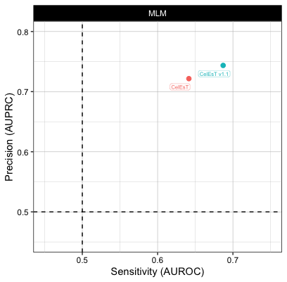

# CelEsT
This repository contains the code for the manuscript - CelEsT: a unified gene regulatory network for estimating transcription factor activities in C. elegans. Perez 2024, Genetics [doi:10.1093/genetics/iyae189/7929675](https://academic.oup.com/genetics/advance-article/doi/10.1093/genetics/iyae189/7929675)

The folders are numbered in order of execution, as are the scripts within each folder. This is important as each script may relay on outputs from previous scripts in order to function.

I have done my best to ensure the code runs smooothly but as in the course of manuscript preparation the code was run interactively there may be some bugs when attempting to run the entire code as is - I apologise in advance.

The scripts containing the code for the analyses and generation of figures in the paper are listed in the file CODE_FOR_FIGURES.rtf

Any questions please raise an issue on this page.

Note several analyses with CelEsT are available via the CelEsT R Shiny app found at [github.com/IBMB-MFP/CelEsT-app].

Thanks for your interest in CelEsT!

**UPDATE 2025-02-21**

I have added the file here and on the [Github repository for the CelEsT app](github.com/IBMB-MFP/CelEsT-app)) for an updated network, CelEsT v1.1, which has a significant performance boost over the CelEsT network initially published.

This was achieved by building the network by cutoffs as for CelEsT but ordering targets by conservation probability of the known in vitro binding motif or the de novo motif as reported for orthCelEsT. In compiling this network, TF-target conservation probabilities were NOT adjusted for multiple corrections, allowing for ordering of many more relevant targets with some conservation signal, thus boosting performance. In the final network, the top 1000 ChIP targets (excluding HOT regions), ordered by orthology (with tie-breaks by ChIP signal) and the top 1000 motif targets ordered by orthology (with tie-breaks by motif strength) were combined with the eY1H data.

